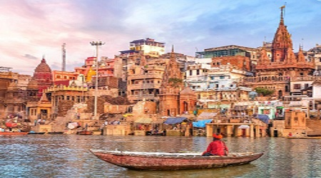
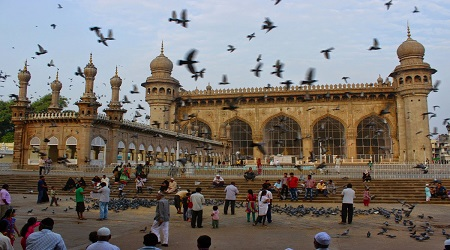
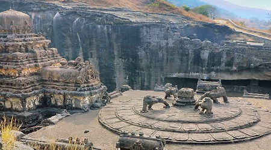

# assignment2-Drakshapally
2nd assignment
# Vivek Drakshapally
## Gobi Manchurian
Gobi Manchurain is an indian chinese fried **cauliflower dish**. The word Manchurian means native or inhabitant of **manchuria**. It is a kolkata originated dish. I love eating Gobi Manchurian because it is very soften and it is a spicy dish. 

****

# SHOPPING FOR THE WINTER CLOTHES
1. Firstly book the cab by using tapride app
2. After booking the cab drop the destination location
3. After reaching the destination location (walmart) pickup the cart
4. Look for the clothes aisle number using walmart mobile app
5. After reaching the clothes aisle look for the clothes
       
        1. Snow Sweater
        2. Hoodie
        3. Skull Cap

6. After selection of clothes go for the billing counter
7. At billing section the walmart employees will scan the barcode and they will say the amount which we have to pay
*  Pay the bill using card or cash 
*  After completion of billing again book the cab by using tapride app

 [Bio and Image](https://github.com/vivekd31/assignment2-Drakshapally/blob/main/AboutMe.md).

****

# RECOMMENDATION PLACES

## 1.The Holy City Of varanasi:
A major pilgrimage center for Hindus, the holy city of Varanasi has long been associated with the mighty Ganges River, one of the faith's most important religious symbols. Dating back to the 8th century BC, Varanasi is one of the oldest still inhabited cities in the world.

| Location | Number of Hours | Amount to Spent |
| --- | ------- | ----- |
| Varanasi | 6 | 7000 |


## 2.Mecca Masjid:
Construction of Hyderabad's Mecca Masjid, one of the world's largest mosques-and one of the oldest in India-began in 1614 during Mohammed Quli Qutub Shah's reign and took almost 80 years to complete. Large enough to accommodate 10,000 worshipers, this beautiful mosque's 15 enormous arches and pillars were each wrought from single slabs of black granite dragged to the site by huge cattle trains reputedly consisting of up to 1,400 bulls.

| Location | Number of Hours | Amount to spent |
| --- | ------- | ----- |
| Hyderabad | 3 | 5000 |


## 3.The Beaches Of Goa:
Long known within India as the "go-to" destination for those seeking a great beach holiday, Goa's beautiful western coastline, overlooking the Arabian Sea, has only recently been discovered by tourists from overseas.

| Location | Number of Hours | Amount to Spent |
| --- | ------- | ----- |
| Goa | 8 | 4000 |


## 4.The Ellora Caves:
The famous monumental Ellora Caves were built between the 5th and 10th centuries by Buddhist, Jain, and Hindu monks, and make for an excellent excursion from Mumbai, some 300 kilometers to the west.

| Location | Number of Hours | Amount to Spent |
| --- | ------- | ----- |
| Aurangabad | 4 | 2000 |



***

# Favourite quotes

>"Some stories have to be written because no one would believe the absurdity of it all."
*Shannon L. Alder*

>"A friend is someone who knows all about you and still loves you.”
*Elbert Hubbard*

***

# Objective-C
>Objective-C is a general-purpose, object-oriented programming language that adds Smalltalk-style messaging to the C programming language. It was the main programming language supported by Apple for macOS, iOS, and their respective application programming interfaces (APIs), Cocoa and Cocoa Touch, until the introduction of Swift in 2014.

Quick link <https://en.wikipedia.org/wiki/Objective-C>

```

#import <Foundation/Foundation.h>

int main() {
   int sum = 17, count = 5;
   CGFloat mean;

   mean = (CGFloat) sum / count;
   NSLog(@"Value of mean : %f\n", mean );

   return 0;
}

```

Quick link <https://www.tutorialspoint.com/objective_c/objective_c_type_casting.htm>
